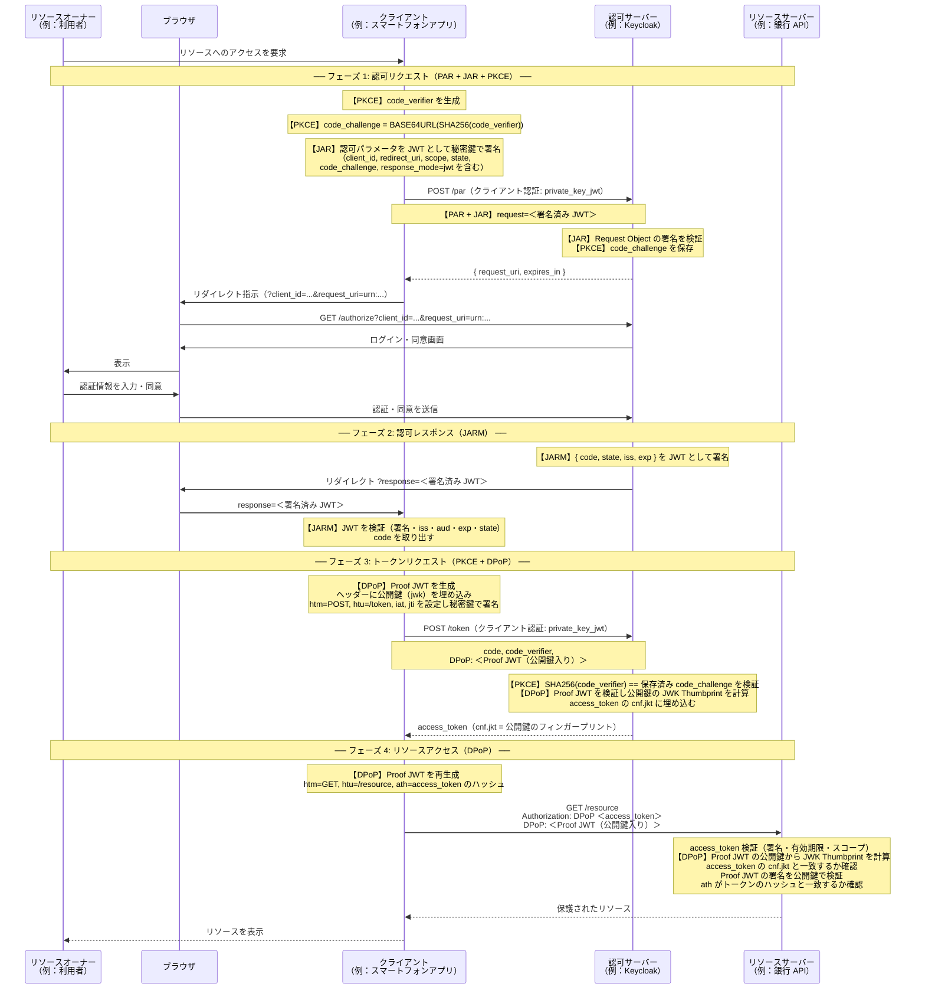
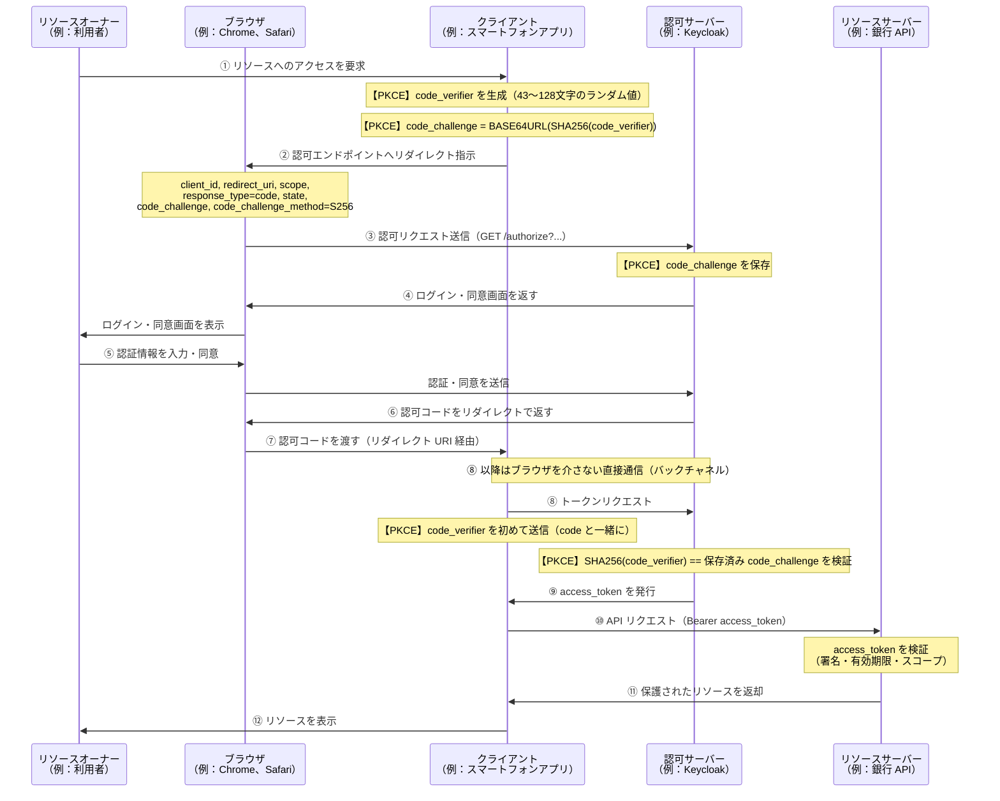
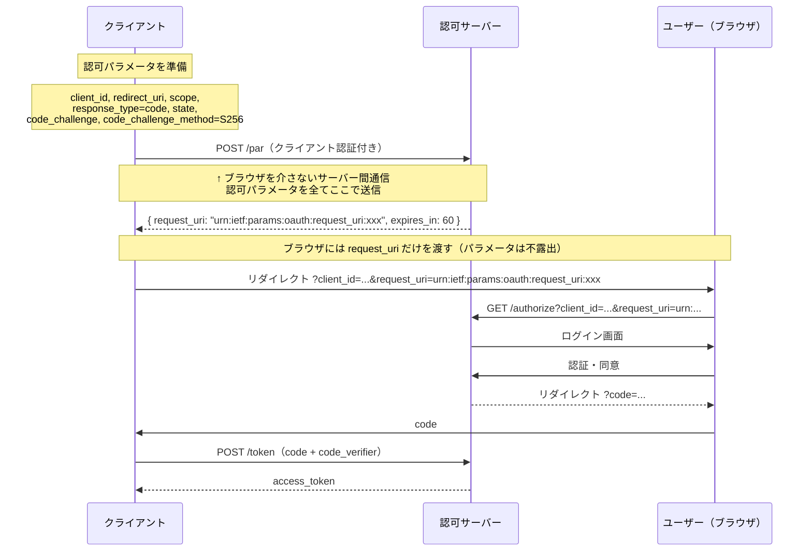
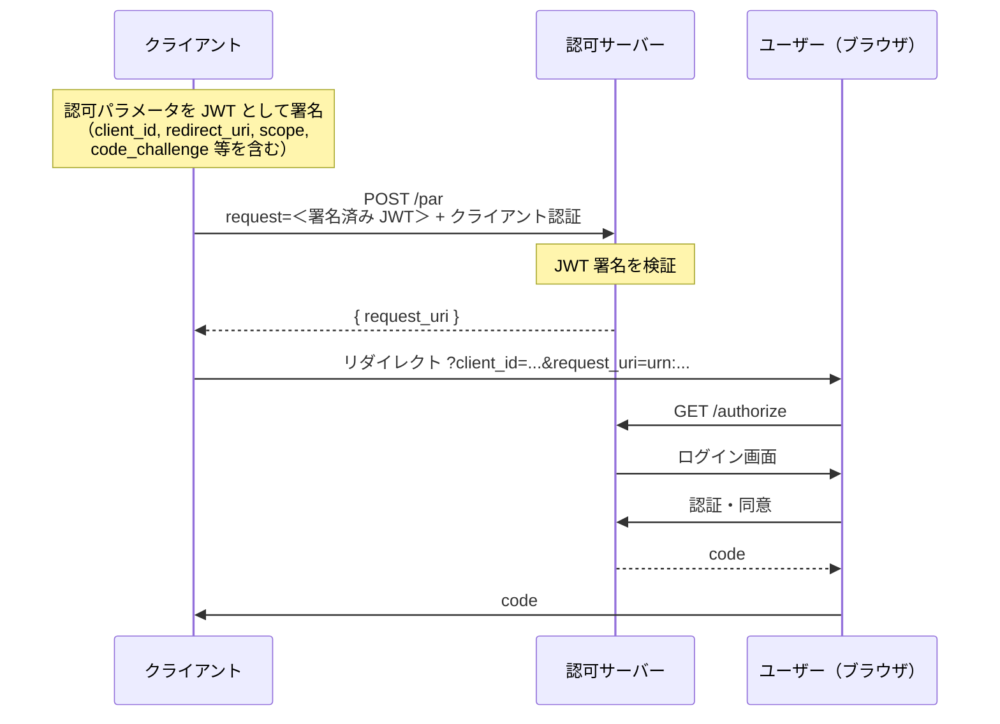
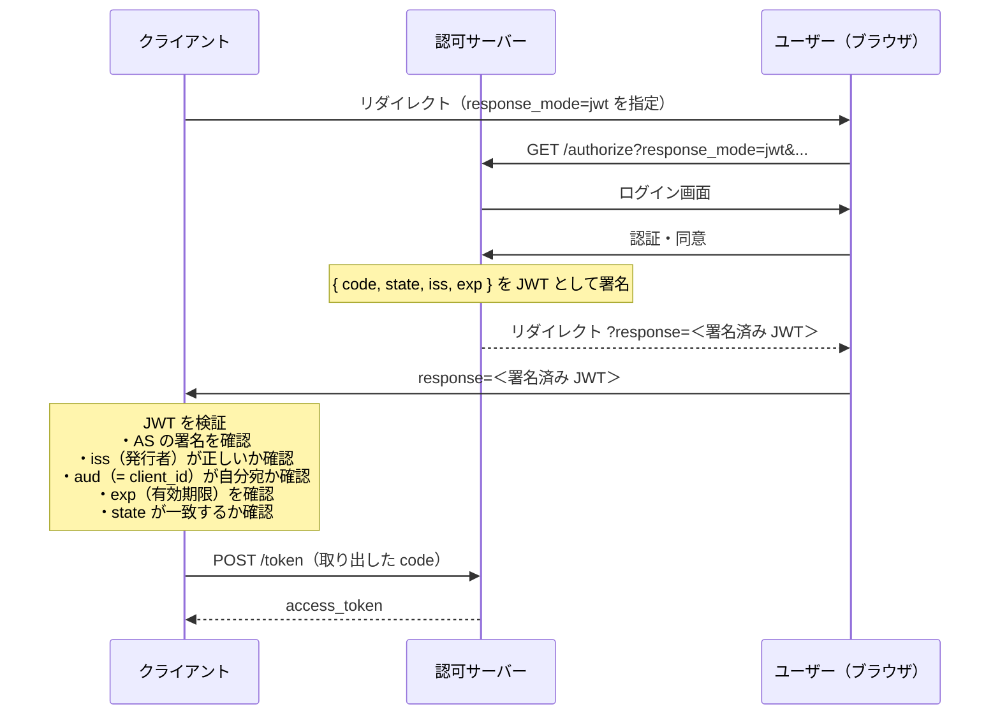
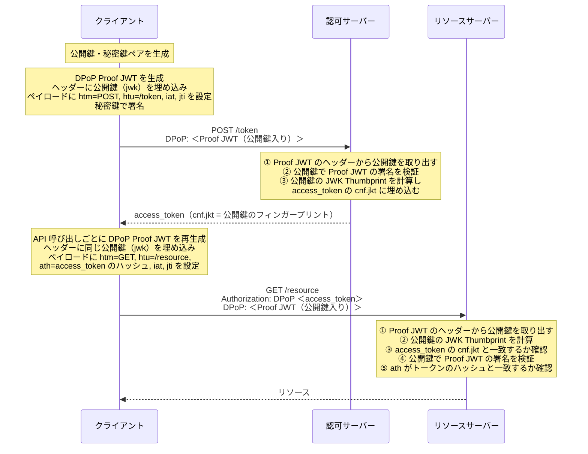
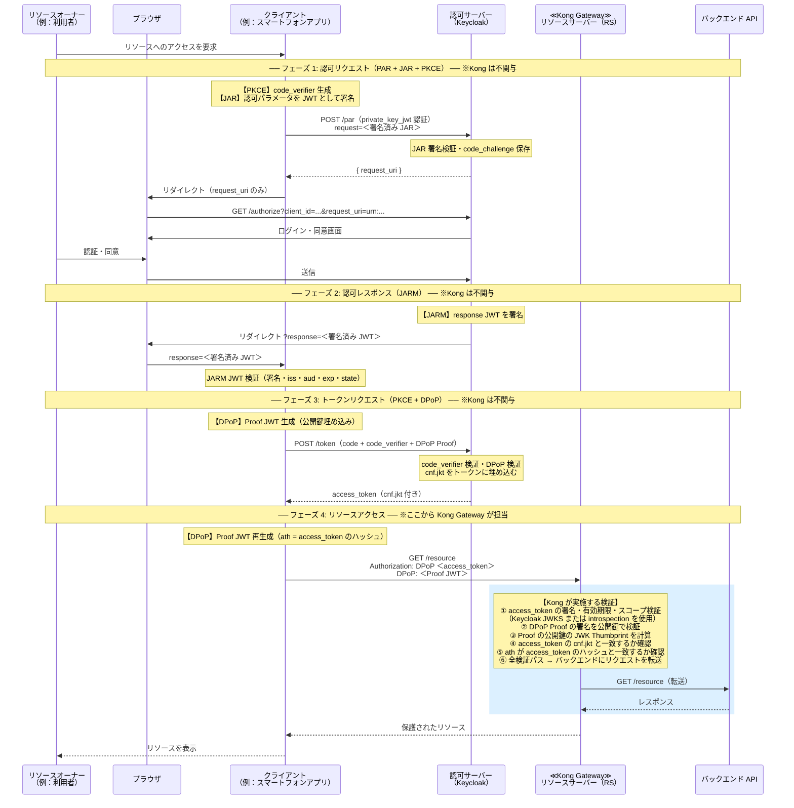

Kong Gateway を使った FAPI 2.0の検証

## 目次

- [FAPI とは](#fapiとは)
  - [概要](#概要)
  - [FAPI 2.0 の特徴](#fapi-20-の特徴)
    - [Security Profile](#fapi-20-security-profile)
    - [Message Signing](#fapi-20-message-signing)
    - [両プロファイルを組み合わせたフロー](#fapi-20-security-profileと-message-signing-を組み合わせた場合の処理)
    - [実装チェックリスト](#実装チェックリスト)
  - [FAPI 2.0 の対応状況](#fapi-20-の対応状況)
- [FAPI の沿革](#fapi-の沿革)
  - [FAPI 1.0 リリースまで](#fapi-10-リリースまで)
  - [FAPI 2.0 リリースまで](#fapi-20-リリースまで)
  - [FAPI 1.0 と 2.0 の相違点](#fapi-10と20の相違点)
- [付録 - 用語解説](#付録---用語解説)
  - [署名アルゴリズム（RS256/ES256/PS256 等）](#rs256es256ps256s256rsa-pss楕円曲線署名)
  - [PKCE](#pkceproof-key-for-code-exchange)
  - [PAR](#parpushed-authorization-requests)
  - [JAR](#jarjwt-secured-authorization-requests)
  - [JARM](#jarmjwt-secured-authorization-response-mode)
  - [DPoP](#dpopdemonstrating-proof-of-possession)
- [API Gateway の FAPI 2.0 対応状況比較](#api-gateway-の-fapi-20-対応状況比較)
- [付録 - Kong Gateway と Keycloak の設定解説](#付録---kong-gateway-と-keycloak-の設定解説)
  - [Kong Gateway（deck.yaml）](#kong-gatewaydeckyaml)
  - [Keycloak（fapi2-realm.json）](#keycloakfapi2-realmjson)
- [Kong Gateway での実装例](#kong-gateway-での実装例)
  - [FAPI 2.0 における Kong Gateway の役割](#fapi-20-における-kong-gateway-の役割)
  - [openid-connect プラグインの FAPI 対応機能](#openid-connect-プラグインの-fapi-対応機能)
  - [「FAPI 2.0 対応」と言えるか](#fapi-20-対応と言えるか)
  - [検証](#検証)
    - [構成](#構成)
    - [環境起動](#環境起動)
    - [自動検証スクリプト](#自動検証スクリプト)
    - [正常系：FAPI 2.0 フローの実行（手動）](#正常系fapi-20-フローの実行手動)
    - [異常系：拒否されることを確認する](#異常系拒否されることを確認する)

---

## FAPIとは
### 概要
FAPI（Financial-grade API）は、OpenID Foundation が策定した高セキュリティ API のセキュリティプロファイル（既存の標準仕様に対して「何を追加で守らなければならないか」を定めた上位仕様）である。OAuth 2.0 / OpenID Connect を基盤としつつ、金融サービスのような高度なセキュリティ要件を持つ API 向けに、より厳格な要件を追加定義している。


主な採用事例を以下に示す。

| 地域 | 規格・フレームワーク | ステータス |
| --- | --- | --- |
| 英国 | [Open Banking Security Profile](https://standards.openbanking.org.uk/security-profiles/) | FAPI 1.0 Advanced を正式採用 |
| EU | [Berlin Group NextGenPSD2](https://www.berlin-group.org/nextgenpsd2-downloads) | PSD2 準拠フレームワークに FAPI を統合 |
| ブラジル | [Open Finance Brasil Security Profile](https://openfinancebrasil.atlassian.net/wiki/spaces/OF/pages/1675395089/) | FAPI 1.0 Advanced を正式採用（独自拡張あり） |
| オーストラリア | [CDR Security Profile](https://consumerdatastandardsaustralia.github.io/infosec/) | Consumer Data Right にて FAPI 1.0 Advanced を正式採用 |
| 日本 | [全国銀行協会 オープン API ガイドライン](https://www.zenginkyo.or.jp/) | FAPI を参照・検討中（義務化はされていない） |

### FAPI 2.0 の特徴

FAPI 2.0 は **Security Profile** と **Message Signing** の2つのプロファイルで構成される。

#### FAPI 2.0 Security Profile

認可フロー全体に関する要件を定めた基盤プロファイルである。このプロファイル単体で、FAPI 1.0 Advanced と同等以上のセキュリティ強度が得られるよう設計されている。以降の説明では **AS**（Authorization Server＝認可サーバー。トークンを発行する役割。本環境では Keycloak が該当）および **RS**（Resource Server＝リソースサーバー。API を保護する役割。通常はバックエンド API サーバー自身が担うが、Kong Gateway のような API ゲートウェイを導入する場合はゲートウェイが RS として機能する）という略称を使用する。

| カテゴリ | 要件 | 説明 |
| --- | --- | --- |
| 認可フロー | Authorization Code Flow のみ | Implicit Flow・ハイブリッドフローは禁止 |
| PKCE | 必須（S256 のみ） | コード横取り攻撃（Authorization Code Interception Attack）を防ぐ |
| PAR | 必須 | 認可リクエストのパラメータをブラウザ URL に露出させない（[RFC 9126](https://www.rfc-editor.org/rfc/rfc9126)） |
| sender-constrained token | DPoP または mTLS（必須） | AS は必ず sender-constrained なアクセストークンを発行しなければならない。クライアントの鍵に紐付けることでトークン窃取時の再利用を防ぐ |
| クライアント認証 | `private_key_jwt` または mTLS | 共有シークレットによる認証（`client_secret_basic` 等）は禁止 |
| `response_type` | `code` のみ | トークンをブラウザに直接渡すフローをすべて排除 |
| JWT 署名アルゴリズム | PS256、ES256、または EdDSA | JWT を作成・検証する箇所で使用可能なアルゴリズム。RS256 は不可 |
| 認可コード有効期間 | 最大 60 秒 | 認可コードの短命化によりコード傍受リスクを低減（FAPI 2.0 仕様要件） |
| アクセストークン有効期間 | 短命を推奨（実装上の推奨） | FAPI 2.0 仕様の明示的な必須要件ではないが、長期有効なトークンの流出リスクを低減するための実装推奨事項である |
| `nonce` | OIDC をサポートする AS では最大 64 文字まで対応必須 | nonce は OIDC における ID Token のリプレイ防止パラメータ。FAPI 2.0 では front-channel の ID Token を前提としないため FAPI 1.0 ほど中心的役割ではないが、OIDC をサポートする AS は 64 文字までの nonce を受け付けなければならない |

#### FAPI 2.0 Message Signing

Security Profile に加えて、**リクエスト・レスポンスそのものに署名**を施す要件を定めたプロファイルである。主な目的は認可リクエスト・レスポンスの integrity（完全性）の保証であり、署名付き PAR リクエスト（JAR）と合わせることで否認不可（non-repudiation）のユースケースも支える。

| カテゴリ | 要件 | 説明 |
| --- | --- | --- |
| JAR | 必須 | JWT Secured Authorization Requests（[RFC 9101](https://www.rfc-editor.org/rfc/rfc9101)）。認可リクエスト全体を JWT として署名する |
| JARM | 必須 | JWT Secured Authorization Response Mode。認可レスポンス（認可コード等）を JWT として署名して返す。主な価値はレスポンスの integrity 保証であり、Mix-Up 攻撃への防御にもなる |
| signed introspection responses | 仕様に含まれる（別 conformance option） | Message Signing 仕様に含まれるが、仕様本文は signed authorization requests / responses / introspection responses を別々の conformance testing option として扱う想定を示している。「Message Signing 全体の一律必須」ではなく、実装する場合の SHALL として規定されている。本稿では認可リクエスト・レスポンスの署名（JAR/JARM）を中心に扱う |

> **Security Profile と Message Signing の関係**
> Message Signing は Security Profile の上位互換である。Message Signing に準拠するためには Security Profile の要件をすべて満たした上で、JAR・JARM を追加実装する必要がある。なお sender-constrained token（DPoP/mTLS）は Security Profile の時点ですでに必須であり、Message Signing 固有の要件ではない。

#### FAPI 2.0 Security Profileと Message Signing を組み合わせた場合の処理

ここまで PKCE・PAR・JAR・JARM・DPoP をそれぞれ個別に見てきた。FAPI 2.0 の適合性評価では観点ごとに分けて検証されることがあるが、決済・銀行 API のような高セキュリティ要件の実装では組み合わせて使われることが多い。たとえば PAR だけ導入しても、認可レスポンスが署名されていなければ中間者に差し替えられるリスクが残る。DPoP でトークンを紐付けても、認可リクエスト自体が改ざん可能なら防御に穴が生じる。

それぞれの技術要素は互いの弱点を補い合っており、組み合わせることで「金融グレード」と呼べるセキュリティレベルに到達するという考え方である。

フルフローは以下の4フェーズで構成される。

| フェーズ | 技術要素 | 概要 |
| --- | --- | --- |
| 1. 認可リクエスト | PAR + JAR + PKCE | パラメータをサーバー間で送信し、内容を署名で保護する |
| 2. 認可レスポンス | JARM | 認可コードを署名付き JWT で返す |
| 3. トークンリクエスト | PKCE + DPoP | code_verifier を検証し、トークンをクライアント鍵に紐付ける |
| 4. リソースアクセス | DPoP | リクエストのたびに秘密鍵の所持を証明する |

では、これらの技術要素が実際のフローのなかでどのように連携するか、シーケンス図で確認しよう。フロー全体を通じて**クライアントは一切素のパラメータをブラウザ経由で渡さず、すべてサーバー間通信か署名済みオブジェクトで保護している**点に注目してほしい。



このフローを見ると、ブラウザ（フロントチャネル）を通過するのは `request_uri`（PAR の参照 URL）と `response`（JARM の署名済み JWT）だけであることがわかる。認可パラメータの実体はサーバー間通信（バックチャネル）で送り済みであり、ブラウザ経由で盗聴・改ざんできる情報はほとんど残っていない。

また、アクセストークンは `cnf.jkt`（クライアント公開鍵のフィンガープリント）を持っており、API へのリクエストごとに対応する秘密鍵で Proof JWT を生成しなければ受け付けられない。仮にトークンが漏洩しても、秘密鍵を持たない第三者は使用できない。

#### 実装チェックリスト

以下に、このフローを実際のシステムで実現するための設定・実装ポイントをまとめる。クライアント側の実装、認可サーバー（Keycloak）の設定、リソースサーバー（Kong Gateway）の設定の3つに分けて確認しよう。

##### クライアント

| 項目 | 内容 |
| --- | --- |
| 鍵ペアの管理 | PS256 または ES256 の鍵ペアを生成・保管する |
| private_key_jwt | クライアント認証用 JWT を秘密鍵で署名して /par・/token に送る |
| JAR 生成 | 認可パラメータをまとめた Request Object JWT を秘密鍵で署名する |
| PAR リクエスト | JAR を request パラメータに乗せて /par へ POST する |
| PKCE | code_verifier を生成し、code_challenge（S256）を JAR 内に含める |
| JARM 検証 | 認可レスポンスの JWT を AS の公開鍵で検証し iss・aud（= client_id）・exp・state を確認する |
| DPoP Proof 生成 | リクエストごとに htm・htu・iat・jti を設定した Proof JWT を生成する |
| DPoP ath クレーム | トークンリクエスト後の API 呼び出しでは access_token の SHA-256 ハッシュを ath に含める |

##### 認可サーバー（Keycloak）

| 項目 | 設定箇所 |
| --- | --- |
| PAR 必須化 | Client → Advanced → Pushed authorization request required: ON |
| JAR 検証 | Client → Advanced → Request object signature algorithm: PS256 または ES256 |
| JARM 有効化 | Client → Advanced → Authorization response signature algorithm: PS256 |
| DPoP 有効化 | Client → Advanced → DPoP bound access tokens: ON |
| PKCE 必須化 | Client → Advanced → Proof Key for Code Exchange Code Challenge Method: S256 |
| クライアント認証 | Client → Credentials → Client Authenticator: Signed JWT（private_key_jwt） |
| トークン署名 | Client → Advanced → Access token signature algorithm: PS256 |

##### リソースサーバー（Kong Gateway）

| 項目 | 内容 |
| --- | --- |
| JWT 検証 | `openid-connect` プラグインで AS の JWKS を用いて access_token の署名を検証する |
| DPoP 検証 | `proof_of_possession_dpop: strict` を設定し cnf.jkt と Proof JWT の照合を有効化する |
| スコープ検証 | `scopes_required` に必要なスコープを指定する |

### FAPI 2.0 の対応状況

FAPI 2.0 Security Profile の最終仕様が 2025年2月に承認されたことで、主要 IdP の対応が本格化しつつある。以下に代表的な IdP の対応状況をまとめる。なお OpenID Foundation による公式の適合性認証（Conformance Certification）は、実装が仕様のすべての要件を満たすことを第三者的に保証するものであり、単に機能を実装しているだけでは認定されない。

#### 機能対応・認証取得状況

| IdP | Security Profile | Message Signing | PAR | JAR | JARM | DPoP | OpenID 認定 |
| --- | --- | --- | --- | --- | --- | --- | --- |
| **Keycloak** | ✅（v26.4で公式サポート表明） | ✅（v26.4で公式サポート表明） | ✅ | ✅ | ✅ | ✅（v26.1+） | 適合性テスト通過（公式認定一覧への掲載は別途確認） |
| **Auth0** | ⚠️ 設定可能 | ⚠️ 設定可能 | ✅ | 不明 | 不明 | 不明 | 未取得 |
| **Okta** | ⚠️ 根拠不足 | 要確認 | ✅ | 要確認 | 要確認 | ✅ | 未取得 |
| **Microsoft Entra ID** | ❌ | ❌ | ❌ | ❌ | ❌ | 未確認（RFC 9449 準拠の対応を確認できず） | 未取得 |
| **Kong Identity** | 不明 | 不明 | 不明 | 不明 | 不明 | 不明 | 未確認 |

#### 各 IdP の補足

**Keycloak**
FAPI 2.0 への対応が最も進んでいる OSS IdP である。FAPI 2.0 用のクライアントプロファイル（`fapi-2-security-profile` / `fapi-2-dpop-security-profile` / `fapi-2-message-signing`）が組み込まれている。DPoP は v26.1 で導入。Security Profile・Message Signing Final への公式サポート表明は v26.4 のリリースノートによる（v26.1 時点では DPoP 追加のみで、Final 仕様全体のサポート表明ではない）。適合性テストは通過しているが、OpenID Foundation の公式認定一覧（<https://openid.net/certification/>）への掲載状況は別途確認が必要である。

**Auth0**（Okta Customer Identity Cloud）
表の「⚠️ 設定可能」は、Auth0 が FAPI 2.0 Security Profile の要件をデフォルトでは満たさないが、`compliance_level` プロパティを使ってテナントを FAPI 2.0 向けに構成（例：`fapi2_sp_pkj_mtls`）することで要件に近づけられる、という意味である。つまり「機能として持っているが、利用者が明示的に設定しなければ FAPI 2.0 モードにならない」状態を示している。Auth0 の公開ドキュメントにある FAPI 2.0 compliance_level の対応表では、`fapi2_sp_pkj_mtls` / `fapi2_sp_mtls_mtls` のいずれも "Enforces the use of JAR" が **N** となっており、Security Profile 相当の設定モードでは JAR は強制されていない。したがって JAR・JARM を含む FAPI 2.0 Message Signing への対応状況は別途確認が必要であり、PAR 対応は確認できるが Message Signing への対応については断定できない。OpenID Foundation の公式認定は未取得であるため、第三者が検証した準拠保証はない。

**Okta**（Workforce Identity Cloud）
DPoP と PAR は公式ドキュメントで確認できる。一方 JAR・JARM については確認できておらず、FAPI 2.0 Security Profile 全体への準拠については根拠不足の状態である。表の「⚠️ 根拠不足」は Security Profile 準拠の明示的な根拠（FAPI 2.0 モードへの設定方法の公式説明等）が不足しているという意味であり、PAR・DPoP 機能の有無とは別の判断である。

**Microsoft Entra ID**
PKCE や `private_key_jwt` などの基本的な OAuth 2.0 / OIDC 機能は対応しているが、PAR は認可サーバーとして対応していない。DPoP については Microsoft が PoP（Proof of Possession）トークンの実装を提供しているが、これが RFC 9449 DPoP と同一であるかは本稿執筆時点で確認できていない。「未確認」と「未対応」は区別する必要があるが、**PAR の未対応**が確認できている時点で Security Profile の必須要件を満たせず、FAPI 2.0 準拠の認可サーバーとして使うことができない。なお MSAL はクライアント側ライブラリであり、Entra ID（認可サーバー）の機能とは別物である。

**Kong Identity**
Konnect プラットフォームに組み込まれた OAuth 2.0 / OIDC 認可サーバーである（[ドキュメント](https://developer.konghq.com/kong-identity/)）。クライアントクレデンシャルフローによる M2M 認証に主眼を置いており、Kong Gateway との統合（openid-connect プラグイン・Introspection プラグイン等）が特徴となっている。ただし、PAR・JAR・JARM・DPoP・private_key_jwt といった FAPI 2.0 固有の機能については公開ドキュメントに記述がなく、対応状況は不明である。FAPI 2.0 準拠が要件となる場合は Kong に直接確認することを推奨する。

> 参考：OpenID Foundation は 2023年5月に最初の FAPI 2.0 self-certifications を公開し、Authlete・Cloudentity・ConnectID・Ping Identity・Raidiam 等を掲載した。ただしこれは Implementer's Draft ベースの認定であり、2025年2月承認の Final specification ベースの認定とは区別する必要がある。大手クラウド IdP（Auth0・Okta・Entra ID）の Final spec ベースの認定取得は 2025年時点では確認できない状況である。

## FAPI の沿革

### FAPI 1.0 リリースまで

| 年月 | 出来事 |
| --- | --- |
| 2017年1月 | EU PSD2（決済サービス指令2）施行準備・英国 CMA による Open Banking 義務化を背景に仕様策定の機運が高まる |
| 2017年3月 | OpenID Foundation にて FAPI Working Group 設立（初回会合：2017年3月29日） |
| 2017年2月 | Implementer's Draft 1 Part 1 公開 |
| 2017年7月 | Implementer's Draft 1 Part 2 公開 |
| 2018年10月 | Implementer's Draft 2 承認（JARM を追加） |
| 2019年4月 | 適合性テスト（Conformance Testing）開始 |
| **2021年3月12日** | **FAPI 1.0 Baseline / Advanced 最終仕様（Final Specification）承認** |

### FAPI 2.0 リリースまで

FAPI 1.0 の普及に伴い、実装経験から得られた知見・OAuth 2.0 セキュリティ BCP の進化・より広いユースケースへの対応を目的として FAPI 2.0 の策定が開始された。

| 年月 | 出来事 |
| --- | --- |
| 2021年7月 | FAPI 2.0 Implementer's Draft 1 承認 |
| 2022年11月〜2023年1月 | Implementer's Draft 2 パブリックレビューおよび承認 |
| **2025年2月19日** | **FAPI 2.0 Security Profile / Attacker Model 最終仕様承認** |
| **2025年9月25日** | **FAPI 2.0 Message Signing 最終仕様承認** |

### FAPI 1.0と2.0の相違点

FAPI 1.0 最終仕様（2021年3月）では「Baseline」「Advanced」の2プロファイル構成であったが、FAPI 2.0 では以下の2プロファイルに再編された。

| プロファイル | 参考：FAPI 1.0 の対応概念 | 概要 |
| --- | --- | --- |
| FAPI 2.0 Security Profile | FAPI 1.0 Advanced に相当（さらに強化） | 認可コードフロー + PKCE + PAR + sender-constrained token |
| FAPI 2.0 Message Signing | FAPI 1.0 に独立した Message Signing プロファイルはないが、Advanced では JARM または `code id_token` による認可レスポンス保護があった | Security Profile ＋ JAR・JARM を中心とした署名（仕様には signed introspection responses も含まれ、別の conformance option として位置づけられる） |

FAPI 1.0 からの主な変更点は以下のとおりである。

| 項目 | FAPI 1.0 | FAPI 2.0 |
| --- | --- | --- |
| PKCE | 任意 | **必須**（S256 のみ） |
| PAR（Pushed Authorization Requests） | 任意 | **必須** |
| response_type | `code` / `code id_token`（ハイブリッド） | `code` のみ |
| Implicit Flow | 使用可 | **禁止** |
| クライアント認証 | `client_secret_basic` 等 | `private_key_jwt` または mTLS |
| JWT 署名アルゴリズム | RS256 可 | **PS256 / ES256 / EdDSA のみ** |
| DPoP / mTLS（sender-constrained token） | 対象外 | **Security Profile で必須**（AS は sender-constrained token しか発行不可） |
| JARM（JWT Secured Authorization Response Mode） | FAPI 1.0 Advanced で任意 | Message Signing プロファイルで必須 |

## 付録 - 用語解説
### RS256/ES256/PS256/S256/RSA-PSS/楕円曲線署名

これらは JWT の署名や PKCE のコード検証に使われるアルゴリズムの識別子である。名前が似ているが、目的・仕組み・強度がそれぞれ異なる。

#### 署名アルゴリズム（JWT の `alg` クレームで指定）

| 識別子 | ベース技術 | 概要 |
| --- | --- | --- |
| **RS256** | RSA + SHA-256 | RSA 秘密鍵で署名し、公開鍵で検証する。実績は豊富だが、鍵サイズが大きく（2048bit 以上推奨）、署名処理が重い |
| **PS256** | RSA-PSS + SHA-256 | RS256 と同じ RSA 鍵を使うが、署名方式を PKCS#1 v1.5 から **PSS（Probabilistic Signature Scheme）** に変更したもの。RS256 より理論的に強固で、FAPI 2.0 では RS256 の代わりにこちらを要求する |
| **ES256** | ECDSA + P-256 + SHA-256 | **楕円曲線**（Elliptic Curve）を使った署名。RSA 系より鍵が短く（256bit）、処理も軽い。モバイル・組み込みに向いており、FAPI 2.0 では PS256 と並んで許可されている |

> **RS256 が FAPI 2.0 で禁止された理由**
> FAPI 2.0 Security Profile は JWT 処理に PS256・ES256・EdDSA のみを要求し、RS256 を許可しない。RS256 が使う PKCS#1 v1.5 パディングは PSS より理論的に弱いとされており、OAuth / JOSE コミュニティの近年のベストプラクティスはより限定されたアルゴリズム集合（PSS 方式・楕円曲線系）の採用に向かっている。これに沿った形で FAPI 2.0 は RS256 を排除している。

#### RSA-PSS とは

RSA-PSS（Probabilistic Signature Scheme）は RSA 署名のパディング方式の一種である。RS256 が使う PKCS#1 v1.5 では署名が決定論的（同じ入力から常に同じ署名が生成される）であるのに対し、PSS はランダムなソルトを混ぜるため署名のたびに異なる値が生成される。PS256 はこの RSA-PSS を SHA-256 と組み合わせたものである。

#### 楕円曲線署名（ECDSA）とは

RSA が「大きな数の素因数分解の困難さ」を安全性の根拠とするのに対し、楕円曲線暗号（ECC）は「楕円曲線上の離散対数問題の困難さ」を根拠とする。同等のセキュリティ強度を RSA の 1/10 以下の鍵長で実現できる。ES256 は P-256 という曲線を使った ECDSA 署名である。

#### S256（PKCE のコード検証方式）

S256 は署名アルゴリズムではなく、**PKCE のコードチャレンジ生成方式**である。

```text
code_verifier（ランダム文字列）
  → SHA-256 ハッシュ
  → Base64URL エンコード
  = code_challenge
```

認可リクエスト時に `code_challenge` を送り、トークンリクエスト時に `code_verifier` を送ることで、認可コードを横取りされても `code_verifier` がなければトークンを取得できないことを保証する。FAPI 2.0 では平文をそのまま送る `plain` 方式を禁止し、S256 のみを許可している。

#### まとめ

| 識別子 | 用途 | 分類 |
| --- | --- | --- |
| RS256 | JWT 署名（FAPI 2.0 では使用不可） | RSA 系 |
| PS256 | JWT 署名（FAPI 2.0 推奨） | RSA 系（PSS） |
| ES256 | JWT 署名（FAPI 2.0 推奨） | 楕円曲線系 |
| S256 | PKCE のコードチャレンジ生成 | ハッシュ（SHA-256） |

### PKCE（Proof Key for Code Exchange）

[RFC 7636](https://www.rfc-editor.org/rfc/rfc7636) で定義されている。認可コードフローにおいて、認可コードを横取りされてもアクセストークンを取得できないようにする仕組みである。

#### 何が問題だったか

認可コードフローでは、認可サーバーからブラウザ経由でクライアントに認可コードが渡される。この時点でコードは URL に含まれるため、悪意あるアプリやブラウザ拡張がコードを横取りし、トークンエンドポイントに先に送りつけることができた（Authorization Code Interception Attack）。

#### どうやって解決したか

認可リクエスト時に `code_challenge`（ハッシュ値）だけを送り、`code_verifier`（元の値）はトークンリクエスト時まで手元に秘匿しておく。認可サーバーはトークンを発行する前に「`code_verifier` を SHA-256 したものが、事前に受け取った `code_challenge` と一致するか」を検証する。

攻撃者が認可コードを横取りしても、`code_verifier` はクライアントの手元にしか存在しないため、トークンエンドポイントに code_verifier を正しく提示できず、トークンを取得できない。

#### PKCEの仕組み



#### S256 が必須な理由

PKCE には `plain`（code_verifier をそのまま送る）と `S256`（SHA-256 でハッシュ）の2方式がある。`plain` では攻撃者が code_challenge を盗んだ時点で code_verifier も判明してしまうため、FAPI 2.0 では `S256` のみを許可している。

#### code_challenge の保存期間

RFC 7636 では `code_challenge` の保存期間は明示されていない。`code_challenge` は認可コードとセットで管理されるため、実質的には**認可コードの有効期限に準じる**。

認可コードの有効期限は OAuth 2.0 の基盤仕様 RFC 6749 に定められており、**最大 10 分を推奨**している。認可コードが使用されるか期限切れになった時点で、紐付く `code_challenge` も合わせて削除される。

> Keycloak のデフォルトは **30 秒**（Admin Console → Realm Settings → Tokens → Authorization Code Lifespan）。

### PAR（Pushed Authorization Requests）

[RFC 9126](https://www.rfc-editor.org/rfc/rfc9126) で定義されている。通常の認可コードフローでは認可パラメータをブラウザのリダイレクト URL に含めるが、PAR ではクライアントが事前にパラメータをサーバー間通信で認可サーバーに「プッシュ」し、代わりに短命の `request_uri` を受け取る。ブラウザには `request_uri` だけを渡すため、パラメータが URL に露出しない。



---

### JAR（JWT Secured Authorization Requests）

[RFC 9101](https://www.rfc-editor.org/rfc/rfc9101) で定義されている。認可リクエストのパラメータ全体を署名付き JWT（Request Object）としてまとめ、改ざんを防ぐ仕組みである。FAPI 2.0 Message Signing では PAR と組み合わせて使用し、クライアントが署名した Request Object を PAR エンドポイントへプッシュする。



**PAR のみとの違い:** PAR だけではパラメータの到達は保護されるが、送信者（クライアント）の正当性は別途クライアント認証で担保する。JAR を加えることでリクエスト内容自体に署名が入り、リクエストの完全性と送信者性の強化に寄与する。Message Signing 全体として non-repudiation のユースケースを支える要素の一つとなる。

---

### JARM（JWT Secured Authorization Response Mode）

[OpenID Foundation 仕様](https://openid.net/specs/oauth-v2-jarm-final.html) で定義されている。認可レスポンス（認可コード等）を認可サーバーが署名した JWT として返す仕組みである。通常のレスポンスはコールバック URL に `code=xxx&state=yyy` を平文で含むが、JARM では JWT 内に格納されるため、レスポンスの改ざんや Mix-Up 攻撃（別の AS のレスポンスをすり替える攻撃）を防ぐことができる。



---

### DPoP（Demonstrating Proof of Possession）

[RFC 9449](https://www.rfc-editor.org/rfc/rfc9449) で定義されている。アクセストークンを発行時にクライアントの公開鍵に紐付けし（sender-constrained token）、トークンが盗まれても別のクライアントが使用できないようにする仕組みである。クライアントはリクエストのたびに秘密鍵で署名した短命の「DPoP Proof JWT」を生成してヘッダーに付与する。リソースサーバーはトークンに埋め込まれた公開鍵と DPoP Proof の署名が一致するかを検証する。

#### 公開鍵の伝達方法

認可サーバーは公開鍵を外部から取得しに行くのではなく、**クライアントが DPoP Proof JWT のヘッダーに公開鍵を直接埋め込んで送る**。認可サーバーはその場でヘッダーから公開鍵を取り出し、署名を検証する。

```text
DPoP Proof JWT の構造

ヘッダー: {
  "typ": "dpop+jwt",
  "alg": "ES256",
  "jwk": { <クライアントの公開鍵（JWK 形式）> }  ← 公開鍵がここに入っている
}
ペイロード: {
  "jti": "一意な ID（リプレイ攻撃対策）",
  "htm": "POST",              ← HTTP メソッド
  "htu": "https://as/token",  ← リクエスト先 URL
  "iat": 1234567890           ← 発行時刻（短命であることを保証）
}
署名: 上記を秘密鍵で署名
```

認可サーバーは検証後、公開鍵の **JWK Thumbprint**（公開鍵を正規化して SHA-256 でハッシュした値）をアクセストークンの `cnf.jkt` クレームに埋め込む。

```text
アクセストークン（JWT）の一部:
{
  "sub": "alice",
  "cnf": {
    "jkt": "0ZcOCORZNYy..."  ← 公開鍵のフィンガープリント
  }
}
```

リソースサーバーは API リクエスト受信時に、DPoP Proof の `jwk` から同じく JWK Thumbprint を計算し、`cnf.jkt` と一致するかを確認する。一致すれば「トークンを発行されたクライアントと同じ秘密鍵を持つ者がリクエストしている」ことが証明される。

#### フロー



**Bearer トークンとの違い:** Bearer トークンは所持しているだけで利用できる（例：HTTP ヘッダーをコピーするだけで再利用可能）。DPoP トークンは対応する秘密鍵がなければ利用できないため、トークンが傍受・窃取された場合のリスクを大幅に低減できる。


## API Gateway の FAPI 2.0 対応状況比較

API Gateway は FAPI 2.0 においてリソースサーバー（RS）として機能し、主に「受け取ったアクセストークンが FAPI 2.0 の要件を満たしているか」を検証する役割を担う。以下は代表的な API Gateway 製品における FAPI 2.0 RS 機能の対応状況である（**公開ドキュメントから確認できた範囲**。「不明」は未調査を意味し、非対応とは異なる）。

> **注意**: この表は API Gateway が **RS として**備える機能の比較であり、IdP（AS）としての機能比較ではない。PAR・JAR・JARM はゲートウェイが OIDC RP / OAuth client mode として動作する場合に関係する機能である。

| 製品 | DPoP 検証 | mTLS 証明書バインド | PAR/JAR/JARM（RP / OAuth client mode 時） | FAPI 明示サポート | 備考 |
| --- | --- | --- | --- | --- | --- |
| **Kong Gateway** | ✅ | ✅ | ✅ | ✅ ドキュメントあり | `openid-connect` プラグインで全機能をネイティブサポート |
| **MuleSoft Anypoint** | 不明 | 不明 | 不明 | 不明 | 公開ドキュメントで FAPI 固有 RS 機能を確認できず |
| **AWS API Gateway** | ❌ | ⚠️ トランスポート層のみ | ❌ | ❌ | JWT Authorizer による基本検証のみ。DPoP・証明書バインド検証はカスタム Lambda が必要 |
| **Google Apigee** | 不明 | 不明 | 不明 | 不明 | 公開ドキュメントで FAPI 固有 RS 機能を確認できず。FAPI 準拠が必要な場合は外部 AS やカスタム実装との組み合わせが必要になる可能性がある |
| **IBM API Connect** | 不明 | 不明 | 不明 | 不明 | API Connect 自体の FAPI RS 機能は公開資料から確認できず。IBM Security Verify（ISVA）側には DPoP・cert-bound token 設定があるが、それは AS 側の機能 |

なお、主要なAPI GWとして上記の製品で比較したが、少しマイナーなものも含めると、TykなどではFAPI2.0対応が進んでいる。

### 補足

**AWS API Gateway** は mTLS をトランスポート層でサポートするが、トークンの `cnf` クレームと証明書を照合する「証明書バインド検証」はネイティブ機能としては提供されていない。DPoP 検証も同様で、カスタム Lambda Authorizer での実装が必要になる。なお AWS から証明書バインドトークンを authorizer で照合するサンプル実装が公開されているが、これはネイティブ機能ではなく実装例である。

**Google Apigee** は OAuth トークン管理・検証の一般機能を持つが、DPoP 検証・証明書バインド・FAPI 向け機能は公開ドキュメントから確認できなかった。FAPI 準拠が必要な場合は外部 AS やカスタム実装との組み合わせを検討する必要がある。

**IBM API Connect** 自体の FAPI RS 機能は本稿の調査範囲では確認できなかった。IBM の公開資料では IBM Security Verify（ISVA）側に DPoP バインドトークン・証明書バインドトークンの設定が存在するが、ISVA は AS（認可サーバー）としての機能であり、API Connect（ゲートウェイ）の RS 機能とは別物である。

**Kong Gateway** は FAPI 2.0 の RS 機能（DPoP 検証・mTLS 証明書バインド）をプラグイン 1 つでネイティブにサポートしており、加えて OIDC RP / OAuth client mode として動作する場合の PAR・JAR・JARM も同プラグインで対応している。他製品と比較して追加実装の必要がない点が特徴である。

---

## Kong Gateway での実装例

### FAPI 2.0 における Kong Gateway の役割

FAPI 2.0 の準拠評価は「システム全体」ではなく **各役割（AS・Client・RS）ごと**に行われる。Kong Gateway が担うのは主に **リソースサーバー（RS）** の役割であり、認可サーバーとしてトークンを発行する役割は Keycloak が担う。

| 役割 | 担う主体 | FAPI 2.0 要件の責任 |
| --- | --- | --- |
| 認可サーバー（AS） | Keycloak | PAR 強制・JAR 検証・JARM 発行・sender-constrained token の発行 |
| クライアント（Client） | アプリケーション | PKCE 生成・JAR 署名・DPoP Proof 生成 |
| リソースサーバー（RS） | **Kong Gateway** | トークン署名検証・DPoP/mTLS の検証・スコープ確認 |

上の表ではクライアントをアプリケーションと整理したが、Kong 自身がクライアント（OIDC RP）として動作するアーキテクチャも存在する。`openid-connect` プラグインを **RP モード**で設定すると、Kong がブラウザを代わりに受け取り、IdP への PAR リクエスト・認可コードフロー・トークン交換を肩代わりする。バックエンドは OAuth を一切意識しなくてよくなるため、OAuth 非対応のレガシーシステムを FAPI 2.0 フローの背後に置く **BFF（Backend for Frontend）** 構成で使われることがある。本リポジトリの検証環境では Kong を RS として使っているが、RP モードでは Kong が「クライアント」列の責務も担う形になる。

フルフローの中で Kong Gateway が介在する箇所を、前掲のシーケンス図と対比できるよう示す。**太枠で囲まれた部分が Kong Gateway の担当範囲**である。



### openid-connect プラグインの FAPI 対応機能

Kong Gateway の `openid-connect` プラグインは、FAPI 2.0 に必要な技術要素をサポートしている。

| 機能 | プラグイン設定 | 対応する FAPI 要件 | 主な動作モード |
| --- | --- | --- | --- |
| PAR | `pushed_authorization_request_endpoint` | Security Profile: PAR 必須 | RP モード |
| JAR | `require_signed_request_object: true` | Message Signing: JAR | RP モード |
| JARM | `response_mode: query.jwt` 等 | Message Signing: JARM | RP モード |
| DPoP 検証 | `proof_of_possession_dpop: strict` | Security Profile: sender-constrained token | RS モード |
| mTLS 証明書バインド検証 | `proof_of_possession_mtls: strict` | Security Profile: sender-constrained token | RS モード |
| mTLS クライアント認証 | `client_auth: tls_client_auth` | Security Profile: 強いクライアント認証 | RS モード |
| スコープ検証 | `scopes_required` | Security Profile: 必要なスコープの強制 | RS モード |

参考: [openid-connect プラグイン FAPI ドキュメント](https://developer.konghq.com/plugins/openid-connect/#financial-grade-api-fapi)

### 「FAPI 2.0 対応」と言えるか

技術的な機能としては FAPI 2.0 に必要な要素をカバーしており、RS として DPoP/mTLS の検証を正しく実施できる点で**「FAPI 2.0 のリソースサーバー要件を技術的に満たせる」**と言える。一方で注意点が2つある。

**役割の分担**: Kong 単体での FAPI 2.0 準拠は成立しない。AS（Keycloak）・クライアント・RS（Kong）の3者がそれぞれの要件を満たして初めてシステム全体が準拠となる。

**正式な適合性認証**: OpenID Foundation は FAPI 2.0 の [Conformance Testing](https://openid.net/certification/) を提供しており、「FAPI 2.0 準拠」を公式に謳うには認定取得が事実上の前提となる。Kong Gateway 自体がこの認定を取得しているかどうかは別途 OpenID Foundation の認定リストで確認が必要である。

> Keycloak の FAPI 関連設定（`require.pushed.authorization.requests` 等）は UI のラベル名がバージョンによって異なる場合がある。本リポジトリは Keycloak 26.x を対象としている。

### 検証

ここからは実際に動作確認してみる。Kong Gateway の `openid-connect` プラグインを設定し、PAR、PKCE、DPoP を使って FAPI 2.0 Security Profile のフローを実行してみる。**なお、以下の手順はクライアント認証に `client_secret_post` を使っており、FAPI 2.0 が要求する `private_key_jwt` または mTLS を使っていない**。PAR・PKCE・DPoP・Kong の受け入れ挙動を確認するための簡易検証であり、FAPI 2.0 準拠構成の実証ではない。

#### 構成

| コンポーネント | ホスト（外部） | ホスト（コンテナ内部） | 役割 |
| --- | --- | --- | --- |
| Keycloak | `http://keycloak.localhost:9080` | `http://keycloak:8080` | AS（認可サーバー） |
| Kong Gateway | `http://localhost:8000` | — | RS（リソースサーバー） |
| httpbin | — | `http://httpbin` | バックエンド API（エコーサーバー） |

#### 環境起動

##### 1. `.env` ファイルを準備する

```bash
cp .env.default .env
```

`.env` を開き、`KONG_LICENSE_DATA` に Kong Enterprise のライセンスを設定する。

##### 2. Docker Compose で全サービスを起動する

```bash
docker compose up -d
```

##### 3. Keycloak の起動を確認する

Keycloak の起動には数十秒かかる。以下のエンドポイントが `200 OK` を返すまで待つ。

```bash
curl -s -o /dev/null -w "%{http_code}" \
  http://keycloak.localhost:9080/realms/fapi2/.well-known/openid-configuration
```

##### 4. deck で Kong に設定を反映する

```bash
deck gateway sync deck/deck.yaml
```

#### 自動検証スクリプト

手順 5〜12 の全フローを1コマンドで自動実行できるスクリプトを用意している。手動手順の代わりに使える。

```bash
python3 scripts/dpop_e2e_verify.py
```

実行すると以下を順に検証し、全項目が `✓` で終わることを確認する。

```text
✓ DPoP key ready
✓ PKCE generated
✓ request_uri (PAR)
✓ Login form / auth code
✓ DPoP-bound token (cnf.jkt match)
✓ Kong accepted DPoP request → 200 OK
✓ Kong rejected missing DPoP proof → 401
```

スクリプトは `dpop-private.pem` が存在すればそれを再利用し、なければ新規生成する。`cryptography` および `requests` ライブラリが必要である（`pip install cryptography requests`）。

---

#### 正常系：FAPI 2.0 フローの実行（手動）

##### 5. DPoP 用の EC キーペアを生成する

DPoP では、クライアントが EC（または RSA）鍵ペアを自前で生成し、Proof JWT の `jwk` ヘッダーに公開鍵を埋め込む。まずキーペアを生成する。

```bash
# 秘密鍵（ES256 用 P-256）
openssl ecparam -name prime256v1 -genkey -noout -out dpop-private.pem

# 公開鍵
openssl ec -in dpop-private.pem -pubout -out dpop-public.pem
```

##### 6. PAR エンドポイントにリクエストして `request_uri` を取得する

PKCE には2つの値が必要だ。認可リクエスト時に送る `code_challenge`（ハッシュ値）と、トークンリクエスト時に送る `code_verifier`（元の乱数）である。

まず `code_verifier` を生成する。
ここではPythonで生成する。
RFC 7636 は 43〜128 文字の URL セーフな文字列を要求する。
`secrets.token_urlsafe(32)` は 32 バイト（256 ビット）の乱数を Base64URL エンコードして返すが、Base64URLエンコードは文字数が約1.33倍に増えるため、結果はちょうど 43 文字になる。

なお、Pythonを使わず`openssl rand -base64 32` を使いたくなるが、openssl は 64 文字ごとに改行を挿入するため避ける。改行が混入すると `code_challenge` の計算結果がずれ、Keycloak に `code not valid` エラーが返る。（trコマンドとか使えばopensslでも改行なしで生成できると思う）

次に `code_challenge` を計算する。S256 方式の定義は以下のとおりだ。

```text
code_challenge = BASE64URL( SHA-256( code_verifier ) )
```

`hashlib.sha256(verifier.encode()).digest()` で SHA-256 ハッシュをバイナリで取得し、`base64.urlsafe_b64encode(...)` で URL セーフ Base64 に変換する。末尾の `.rstrip(b'=')` はパディング文字 `=` の除去で、RFC 7636 が明示的に要求している。

上記の内容を Python のワンライナーで実行し、環境変数 `CODE_VERIFIER` と `CODE_CHALLENGE` に保存する。これをステップ 7 とステップ 8 で使用する。
```bash
eval $(python3 <<'EOF'
import secrets, base64, hashlib
verifier = secrets.token_urlsafe(32)
challenge = base64.urlsafe_b64encode(hashlib.sha256(verifier.encode()).digest()).rstrip(b'=').decode()
print(f'CODE_VERIFIER="{verifier}"')
print(f'CODE_CHALLENGE="{challenge}"')
EOF
)
echo "code_verifier: $CODE_VERIFIER"
echo "code_challenge: $CODE_CHALLENGE"
```

保存した `CODE_VERIFIER` と `CODE_CHALLENGE` を使って、PAR エンドポイントにリクエストを送る。

```bash
PAR_RESPONSE=$(curl -sS -X POST \
  http://keycloak.localhost:9080/realms/fapi2/protocol/openid-connect/ext/par/request \
  -H "Content-Type: application/x-www-form-urlencoded" \
  -d "client_id=fapi2-test-client" \
  -d "client_secret=fapi2-test-secret" \
  -d "response_type=code" \
  -d "scope=openid profile" \
  -d "redirect_uri=https://openidconnect.net/callback" \
  -d "code_challenge=$CODE_CHALLENGE" \
  -d "code_challenge_method=S256" \
  -d "state=$(openssl rand -hex 16)")

echo $PAR_RESPONSE
REQUEST_URI=$(echo $PAR_RESPONSE | jq -r '.request_uri')
```

通常の認可コードフローでは、`client_id` や `redirect_uri` などのパラメータをすべてブラウザのリダイレクト URL に載せる。PAR はこれを逆転させる。パラメータをまずサーバー間通信（バックチャネル）で AS に送りつけ、代わりに短命の参照 ID（`request_uri`）を受け取る。ブラウザにはその参照 ID だけを渡すので、認可パラメータが URL に一切露出しない。FAPI 2.0 はこの PAR を必須としている。

エンドポイントは `/auth` ではなく `/ext/par/request` だ。RFC 9126 は PAR を「ブラウザではなくクライアントサーバーが直接叩く専用エンドポイント」として `/authorize` とは別に定義することを要求している。Keycloak はそのエンドポイントを `/ext/par/request` というパスで実装しており、実際の URL は Discovery ドキュメント（`/.well-known/openid-configuration`）の `pushed_authorization_request_endpoint` フィールドで確認できる。クライアント認証もここで行う。本環境ではテスト用に `client_secret_post`（POSTボディにシークレットを含める方式）を使っているが、FAPI 2.0 の本来の要件はより強い認証方式（`private_key_jwt` または mTLS）を要求する。テスト目的のため Keycloak のクライアント設定でシークレット認証を許可している。

`code_challenge_method=S256` は、トークンリクエスト時に `code_verifier` を受け取った AS が「どのアルゴリズムで `code_challenge` を再計算すればよいか」を知るためのパラメータだ。AS はここで指定された方式で検証するため、省略すると AS 側がどのハッシュ関数を使えばよいかわからない。`S256` は SHA-256 でハッシュすることを意味する。FAPI 2.0 はこの `S256` のみを許可しており、`plain`（ハッシュなしで `code_verifier` をそのまま `code_challenge` として使う）は禁止されている。`state` は FAPI 2.0 では必須ではない。OAuth 2.0 では CSRF 対策として使われてきたが、FAPI 2.0 の Security Profile では「認可リクエストの CSRF 防御手段として state を使わない。PKCE がその役割を担う」と整理されており、必須要件から外れた（FAPI 1.0 では必須だった）。ただし CSRF 対策そのものが不要になるわけではなく、認可フロー開始自体を CSRF から保護する責任はクライアント側にある。用途があるとすれば「ログイン後にどのページに戻るか」といったアプリケーション側の状態管理だ。ここでは動作確認のために付けているが、省略しても FAPI 2.0 の要件は満たせる。


成功すると以下のようなレスポンスが返る。

```json
{"request_uri":"urn:ietf:params:oauth:request_uri:xxxxxxxx-xxxx-xxxx-xxxx-xxxxxxxxxxxx","expires_in":600}
```

`request_uri` は `urn:ietf:params:oauth:request_uri:` で始まる不透明な参照 ID だ。中身のパラメータは AS 側に保存されており、クライアントは参照 ID しか受け取らない。この ID はワンタイム使用で、`expires_in` の 600 秒（realm 設定 `parRequestUriLifespan`）以内に一度だけ使える。

##### 7. ブラウザで認可エンドポイントにアクセスしてログインし、認可コードを取得する

> **注意**: `request_uri` はワンタイム使用である。URL を開いた時点で消費されるため、同じ URL をリロード・再利用することはできない。エラーになった場合はステップ 6 からやり直す。なお、`request_uri` の有効期限はデフォルト 600 秒（realm 設定 `parRequestUriLifespan`）であるため、URL 生成後 10 分以内にブラウザで開くこと。

以下のコマンドで URL を生成し、ブラウザで開く。alice（パスワード: `alice-pass`）でログインする。

```bash
# request_uri はコロンを含むため URL エンコードが必要
ENCODED_REQUEST_URI=$(echo "$REQUEST_URI" | jq -Rr @uri)
AUTH_URL="http://keycloak.localhost:9080/realms/fapi2/protocol/openid-connect/auth?client_id=fapi2-test-client&request_uri=${ENCODED_REQUEST_URI}"
echo $AUTH_URL
```

ログイン後、ステップ 6 で指定した `redirect_uri` にリダイレクトされる。`code` パラメータがクエリに含まれているので、その値をコピーして次のステップで使う。

###### インターネットに接続できる環境の場合（`redirect_uri=https://openidconnect.net/callback`）

[openidconnect.net](https://openidconnect.net) は OIDC の動作確認用に公開されているツールで、リダイレクトされてきたクエリパラメータをそのまま画面に表示してくれる。コードを画面から読み取れるので手動検証に便利だ。

###### インターネット接続が制限されている環境の場合

PAR リクエストの `redirect_uri` を `http://localhost:8000/anything` に変更する。ステップ 8 のトークンリクエストも同じ値に合わせること。

```bash
  -d "redirect_uri=http://localhost:8000/anything" \
```

ログイン後、ブラウザは `http://localhost:8000/anything?code=...&session_state=...&iss=...` にリダイレクトされる。Kong は認証ヘッダーがないため 401 を返すが、**ブラウザのアドレスバーに表示される URL** に `code` パラメータが含まれているのでそこからコピーできる。Keycloak はリダイレクト先が実際に応答するかどうかは検証しないため、Kong が 401 を返しても認可コードの取得には影響しない。

> **注意**: 認可コードは **5 分以内**（`accessCodeLifespan: 300`）にトークンリクエストで消費すること。また `AUTH_CODE` と `CODE_VERIFIER` は必ず**同じセッション**のものを使う。ステップ 6 をやり直した場合は認可フローも最初からやり直す。

```bash
AUTH_CODE=<取得した認可コード>
```

##### 8. DPoP Proof JWT を生成し、トークンエンドポイントで認可コードを交換する

DPoP Proof JWT は「このリクエスト専用の署名」だ。通常の Bearer トークンと違い、DPoP はトークンを使うたびに秘密鍵で新しい Proof を生成し、それをリクエストに添付する。サーバー側はこの Proof の署名を検証することで「トークンの正当な保有者が今まさにリクエストしている」ことを確認する。

Proof JWT は以下の構造を持つ。

```text
ヘッダー: {
  "typ": "dpop+jwt",   ← このトークン種別が DPoP Proof であることを示す
  "alg": "ES256",      ← 署名アルゴリズム
  "jwk": { ... }       ← 公開鍵をそのまま埋め込む（AS が別途取得しに行かなくてよい）
}
ペイロード: {
  "jti": "<ランダム値>",  ← リプレイ攻撃防止。毎回異なる値にする
  "htm": "POST",          ← このProofが有効なHTTPメソッド
  "htu": "<トークンURL>", ← このProofが有効なURL（他のエンドポイントでは使えない）
  "iat": <現在時刻>       ← 発行時刻。古すぎるProofはASに拒否される
}
```

`htm` と `htu` でリクエストの宛先に縛られているため、傍受した Proof を別のエンドポイントや別のメソッドで再利用することができない。`jti` がユニークなのは同じ Proof を二重送信するリプレイ攻撃を防ぐためだ。

Python でプルーフを生成し、curl は別コマンドで実行する。

cryptography がない場合は事前にインストールする。
```bash
pip install cryptography
```
以下を実行してProof JWTを生成し、環境変数 `DPOP_PROOF` に保存する。
```bash
# ① DPoP Proof を生成して変数に保存
DPOP_PROOF=$(python3 <<'EOF'
import json, base64, os, time
from cryptography.hazmat.primitives.serialization import load_pem_private_key
from cryptography.hazmat.primitives.asymmetric.ec import ECDSA
from cryptography.hazmat.primitives.hashes import SHA256
from cryptography.hazmat.primitives.asymmetric.utils import decode_dss_signature

def b64url(data):
    if isinstance(data, str): data = data.encode()
    return base64.urlsafe_b64encode(data).rstrip(b'=').decode()

# 秘密鍵を読み込み、公開鍵の x・y 座標を JWK 形式に変換する
priv = load_pem_private_key(open('dpop-private.pem', 'rb').read(), password=None)
pub  = priv.public_key().public_numbers()
jwk  = {"kty":"EC","crv":"P-256",
        "x":b64url(pub.x.to_bytes(32,'big')),
        "y":b64url(pub.y.to_bytes(32,'big'))}

# ヘッダーに公開鍵を埋め込む。AS はここから取り出して署名を検証し JWK Thumbprint を計算する
header  = {"typ":"dpop+jwt","alg":"ES256","jwk":jwk}
payload = {"jti":b64url(os.urandom(16)),   # ユニークID（リプレイ防止）
           "htm":"POST",                    # このProofはPOSTにのみ有効
           "htu":"http://keycloak.localhost:9080/realms/fapi2/protocol/openid-connect/token",
           "iat":int(time.time())}          # 発行時刻（古すぎると拒否される）

h = b64url(json.dumps(header, separators=(',',':')))
p = b64url(json.dumps(payload, separators=(',',':')))
signing_input = f"{h}.{p}"

# Python の cryptography ライブラリは DER 形式で署名を返すが、
# JWT の ES256 は r と s を 32 バイトずつ連結した raw 形式を要求する
der_sig = priv.sign(signing_input.encode(), ECDSA(SHA256()))
r, s = decode_dss_signature(der_sig)
print(f"{signing_input}.{b64url(r.to_bytes(32,'big') + s.to_bytes(32,'big'))}")
EOF
)
```

JWT の生成手順を整理すると以下のようになる。

```text
① ヘッダーと ペイロードをそれぞれ JSON にシリアライズし、BASE64URL エンコードする
   h = BASE64URL( JSON(header) )
   p = BASE64URL( JSON(payload) )

② ドットで結合したものが署名対象（signing_input）
   signing_input = h + "." + p

③ signing_input を秘密鍵（P-256）で署名する
   ECDSA の署名結果は r と s という2つの整数のペアになる。
   r は「署名時に使った乱数点の x 座標から導いた値」、
   s は「メッセージのハッシュ・秘密鍵・r を組み合わせて計算した値」だ。
   この2つを揃えることで「秘密鍵を持つ者がこの内容に同意した」ことを証明できる。
   検証側は公開鍵と r, s を使って数学的に確認するだけでよく、秘密鍵は一切不要だ。

   → cryptography ライブラリは r と s を ASN.1 DER 形式（各値の長さ情報も含む構造体）で返す
   → JWT の ES256 は DER ではなく r と s を 32 バイトずつ素直に並べた raw 形式を要求する
   → decode_dss_signature() で DER を解析して r, s の整数を取り出し、
      それぞれ 32 バイトのバイト列に変換して連結する（合計 64 バイト）

④ 署名を BASE64URL エンコードして末尾に付ける
   DPoP Proof JWT = h + "." + p + "." + BASE64URL(r || s)
```

JWT 全体は `.` 区切りの3パートで構成される。これはアクセストークンや ID Token と同じ構造だ。DPoP Proof が特殊なのは、ヘッダーに公開鍵（`jwk`）が含まれている点と、ペイロードが「このリクエスト専用」の情報だけで構成されている点だ。

DPoP Proof の準備ができたら、トークンエンドポイントに認可コードを送って、アクセストークンに交換する。このリクエストが FAPI 2.0 の肝になる部分で、OAuth 2.0 の通常のコード交換に DPoP バインディングが加わった形だ。

```bash
TOKEN_RESPONSE=$(curl -sS -X POST \
  http://keycloak.localhost:9080/realms/fapi2/protocol/openid-connect/token \
  -H "Content-Type: application/x-www-form-urlencoded" \
  -H "DPoP: $DPOP_PROOF" \
  -d "grant_type=authorization_code" \
  -d "code=$AUTH_CODE" \
  -d "redirect_uri=https://openidconnect.net/callback" \
  -d "client_id=fapi2-test-client" \
  -d "client_secret=fapi2-test-secret" \
  -d "code_verifier=$CODE_VERIFIER")

echo $TOKEN_RESPONSE | jq .
ACCESS_TOKEN=$(echo $TOKEN_RESPONSE | jq -r '.access_token')
```
各パラメータの意味を整理しておく。

- **`grant_type=authorization_code`** — OAuth 2.0 の認可コードグラントを使うことを宣言する。Keycloak はこれを見てコード交換モードで動作する。
- **`code=$AUTH_CODE`** — ステップ 7 で取得した認可コード。一回限りの使い捨てで、消費済みのコードを再送するとエラーになる。
- **`redirect_uri`** — PAR リクエスト（ステップ 6）で指定した値と **完全一致** する必要がある。Keycloak は受け取ったリクエストを PAR で保存した内容と突き合わせ、値が異なればトークンを発行しない。これは「認可コードを横取りして別のクライアントがトークンを取ろうとする攻撃」を防ぐための検証だ。ここでは `https://openidconnect.net/callback` を使っているが、インターネット接続が制限されている環境では `http://localhost:8000/anything` に変更すること。
- **`client_id` / `client_secret`** — `client_secret_post` 方式によるクライアント認証だ。リクエストボディにシークレットを直接含めるシンプルな方法で、FAPI 2.0 は本来 `private_key_jwt`（クライアント自身の秘密鍵で署名した JWT）か mTLS を要求している。`client_secret_post` は検証目的の妥協点であり、本番運用では使わない。
- **`code_verifier=$CODE_VERIFIER`** — PKCE の検証用の値だ。ステップ 6 で生成した元のランダム文字列を送る。Keycloak はこれを受け取って `BASE64URL(SHA-256(code_verifier))` を計算し、PAR リクエスト時に受け取った `code_challenge` と一致するか確認する。一致すれば「認可コードを申請したクライアントと、今トークンを要求しているクライアントが同一人物だ」と証明できる。
- **`DPoP: $DPOP_PROOF` ヘッダー** — これが DPoP バインドトークン発行のトリガーになる。Keycloak は Proof JWT のヘッダーに埋め込まれた `jwk`（公開鍵）を使って署名を検証し、`htm` が `POST`・`htu` がトークンエンドポイントの URL であることを確認する。検証が通ると、公開鍵の JWK Thumbprint を計算して `cnf.jkt` としてアクセストークンに埋め込む。これ以降、このトークンは「`cnf.jkt` に対応する秘密鍵を持つ者しか使えない」という制約を持つ。


トークンペイロードをデコードして cnf.jkt を確認する。
`cnf.jkt` は「このトークンを使えるのは、この JWK Thumbprint の鍵を持つ者だけ」という束縛を表す。
ここに値が入っていれば DPoP バインドが成功している。
```sh
echo $ACCESS_TOKEN | jq -R 'split(".")[1] | @base64d | fromjson | {cnf, typ}'
```

`cnf.jkt` に値が入っていれば成功だ。`cnf.jkt` は公開鍵を正規化して SHA-256 でハッシュした値（JWK Thumbprint）で、Keycloak がトークン発行時に Proof の `jwk` から計算して埋め込む。Kong はリクエストを受け取ったときに DPoP Proof の公開鍵から同じ Thumbprint を計算し、この値と照合する。

なお、JWT ペイロード内の `token_type` は Keycloak のバージョンによって `null` になることがある。これは問題ではない。RFC 9449 が Resource Server（Kong）に要求する検証は `cnf.jkt` と DPoP Proof の鍵一致であり、JWT ペイロード内の `token_type` クレームは検証対象ではない。`token_type: DPoP` はトークンエンドポイントの HTTP レスポンスボディに現れるもので、クライアントへの「DPoP proof を添えて使え」という指示だ。

> `cnf.jkt` が `null` の場合、Keycloak がトークンに DPoP バインディングを付与していない。`DPOP_PROOF` が空でないにもかかわらず `cnf.jkt` が null の場合は、Keycloak の DPoP 設定を確認する。introspection レスポンスで直接確認する場合は以下を実行する。
>
> ```bash
> curl -s -X POST \
>   http://keycloak.localhost:9080/realms/fapi2/protocol/openid-connect/token/introspect \
>   -H "Content-Type: application/x-www-form-urlencoded" \
>   -d "token=$ACCESS_TOKEN" \
>   -d "client_id=kong" \
>   -d "client_secret=kong-secret" | jq '{active, cnf}'
> ```

##### 9. Kong 経由でバックエンド API を呼び出す

API 呼び出し用の DPoP Proof はトークンリクエスト時とは別に生成する。
```bash
DPOP_PROOF_API=$(ACCESS_TOKEN="$ACCESS_TOKEN" python3 <<'EOF'
import json, base64, os, time, hashlib
from cryptography.hazmat.primitives.serialization import load_pem_private_key
from cryptography.hazmat.primitives.asymmetric.ec import ECDSA
from cryptography.hazmat.primitives.hashes import SHA256
from cryptography.hazmat.primitives.asymmetric.utils import decode_dss_signature

def b64url(data):
    if isinstance(data, str): data = data.encode()
    return base64.urlsafe_b64encode(data).rstrip(b'=').decode()

priv = load_pem_private_key(open('dpop-private.pem', 'rb').read(), password=None)
pub  = priv.public_key().public_numbers()
jwk  = {"kty":"EC","crv":"P-256",
        "x":b64url(pub.x.to_bytes(32,'big')),
        "y":b64url(pub.y.to_bytes(32,'big'))}

ath = b64url(hashlib.sha256(os.environ['ACCESS_TOKEN'].encode()).digest())

header  = {"typ":"dpop+jwt","alg":"ES256","jwk":jwk}
payload = {"jti":b64url(os.urandom(16)),
           "htm":"GET",
           "htu":"http://localhost:8000/anything",
           "iat":int(time.time()),
           "ath":ath}

h = b64url(json.dumps(header, separators=(',',':')))
p = b64url(json.dumps(payload, separators=(',',':')))
signing_input = f"{h}.{p}"

der_sig = priv.sign(signing_input.encode(), ECDSA(SHA256()))
r, s = decode_dss_signature(der_sig)
print(f"{signing_input}.{b64url(r.to_bytes(32,'big') + s.to_bytes(32,'big'))}")
EOF
)
```

コードの骨格（鍵の読み込み・JWK 構築・b64url 関数・DER→raw 変換）はステップ 8 と同じなので省略し、ここではステップ 8 との差分だけを説明する。

**`htm`・`htu` の変更**

```json
"htm": "GET",
"htu": "http://localhost:8000/anything",
```

ステップ 8 では `htm: POST`、`htu` が Keycloak のトークンエンドポイントだった。DPoP Proof は `htm`＋`htu` の組み合わせに縛られているため、トークン取得時の Proof をそのまま API 呼び出しに使い回すことはできない。Kong は受け取った Proof の `htm`・`htu` が実際のリクエストのメソッド・URL と一致するか検証し、不一致なら拒否する。

**`ath` クレーム（RFC 9449 §4.2）**

```python
ath = b64url(hashlib.sha256(os.environ['ACCESS_TOKEN'].encode()).digest())
```

`ath` は「この Proof がどのアクセストークンに対して作られたか」を示す。アクセストークンの ASCII 文字列を UTF-8 でエンコードし、SHA-256 ハッシュを取って base64url にしたものだ。これにより Proof とトークンが 1 対 1 で紐付けられ、攻撃者が別のトークンを手に入れたとしても、この Proof と組み合わせて使うことができなくなる。トークンリクエスト時には `ath` は不要だった（まだアクセストークンが存在しないため）。

`ACCESS_TOKEN` を `os.environ` 経由で渡しているのは、Python ヒアドキュメント内では bash の変数展開（`$ACCESS_TOKEN`）が効かないためだ。`ACCESS_TOKEN="$ACCESS_TOKEN" python3 <<'EOF'` の形で親シェルの変数を子プロセスの環境変数として明示的に渡している。

作成した `DPOP_PROOF_API` をリクエストヘッダー `DPoP` に添えて、Kong 経由で httpbin のエンドポイントを呼び出す。Kong は Proof を検証し、トークンの `cnf.jkt` と Proof の鍵が一致すればリクエストを httpbin に転送する。
```sh
curl -i http://localhost:8000/anything \
  -H "Authorization: DPoP $ACCESS_TOKEN" \
  -H "DPoP: $DPOP_PROOF_API"
```

httpbin のレスポンス（リクエストヘッダーのエコー）が返れば成功である。レスポンス内の `headers` フィールドで `Authorization` ヘッダーが確認できる。

#### 異常系：拒否されることを確認する

##### 10. DPoP Proof なしでアクセスする → 401 を確認する

DPoP Proof ヘッダーを省略すると、Kong が「sender-constrained token なのに Proof がない」と判断して 401 を返す。

```bash
curl -i http://localhost:8000/anything \
  -H "Authorization: DPoP $ACCESS_TOKEN"
# → HTTP/1.1 401 Unauthorized
```

##### 11. PAR なしで認可エンドポイントに直接アクセスする → Keycloak が拒否することを確認する

Keycloak の `fapi2-test-client` は `require.pushed.authorization.requests: true` が設定されているため、`request_uri` を使わない通常の認可リクエストは拒否される。

```bash
# request_uri を使わず直接パラメータを渡す（PAR なし）
curl -i "http://keycloak.localhost:9080/realms/fapi2/protocol/openid-connect/auth?\
client_id=fapi2-test-client&response_type=code&scope=openid&\
redirect_uri=https://openidconnect.net/callback&\
code_challenge=$CODE_CHALLENGE&code_challenge_method=S256"
# → エラーレスポンス（Pushed Authorization Request is required）
```

##### 12. グループ未所属の charlie のトークンで Kong にアクセスする

charlie は `fapi2-users` Consumer Group に属していないが、現在の deck.yaml には ACL プラグインが設定されていないため、グループ未所属を理由に自動的に 401 になるわけではない。グループベースのアクセス制御を実際に動作させるには ACL プラグインの追加が必要だ。手順 6〜8 を charlie のクレデンシャル（パスワード: `charlie-pass`）で繰り返すことで、Keycloak の認証は通るが Kong 側に Consumer Group による制限がないことを確認できる。

```bash
curl -i http://localhost:8000/anything \
  -H "Authorization: DPoP $CHARLIE_ACCESS_TOKEN" \
  -H "DPoP: $CHARLIE_DPOP_PROOF"
# → HTTP/1.1 401 Unauthorized
```

---

## 付録 - Kong Gateway と Keycloak の設定解説

ここでは `deck/deck.yaml`（Kong）と `keycloak/realm-import/fapi2-realm.json`（Keycloak）の各設定値が何を意味し、FAPI 2.0 のどの要件に対応するかを整理する。

### Kong Gateway（deck.yaml）

#### openid-connect プラグイン

```yaml
auth_methods:
  - introspection
```

Kong がトークンを検証する方式として introspection を選択している。Kong はアクセストークンを受け取るたびに Keycloak の introspection エンドポイントへ問い合わせ、トークンの有効性・クレームを確認する。JWT 署名検証（`bearer_jwt_auth`）を使う方法もあるが、introspection はトークンのリアルタイム失効が反映される利点がある。

```yaml
issuer: ${{ env "DECK_ISSUER" }}
using_pseudo_issuer: true
```

`using_pseudo_issuer: true` は Kong に「この issuer から Discovery を行わない」と指示するフラグだ。通常 Kong は issuer URL から `/.well-known/openid-configuration` を取得して各エンドポイントを自動解決するが、このフラグを立てると discovery を行わない。そのため `introspection_endpoint` を明示設定している。`issuer` の値はトークンの `iss` クレームとの対応付けに使われる。

```yaml
introspection_endpoint: ${{ env "DECK_INTROSPECTION_ENDPOINT" }}
client_id:
  - ${{ env "DECK_CLIENT_ID" }}
client_secret:
  - ${{ env "DECK_CLIENT_SECRET" }}
client_auth:
  - client_secret_post
introspection_endpoint_auth_method: client_secret_post
```

introspection エンドポイントへのリクエストには Kong 自身のクライアント認証が必要だ。`client_auth: client_secret_post` は POST ボディにクライアントIDとシークレットを含めて送る方式で、本環境では Keycloak の `kong` クライアントに対して認証している。FAPI 2.0 Security Profile が要求するクライアント認証（`private_key_jwt` または mTLS）はエンドユーザー向けクライアント（`fapi2-test-client`）の要件であり、Kong 自身の introspection 用認証には直接適用されない。

```yaml
bearer_token_param_type:
  - header
```

アクセストークンを Authorization ヘッダーからのみ受け付ける設定だ。クエリパラメータや POST ボディでのトークン送信を拒否する。FAPI 2.0 は RFC 6750 §5.3 の要求に従い、トークンの URL 露出を禁止しているため、ヘッダー限定にしている。

```yaml
proof_of_possession_dpop: strict
```

DPoP 検証を厳格モードで有効にする設定だ。`strict` を指定すると、`Authorization: DPoP <token>` 形式のリクエストには必ず `DPoP:` ヘッダーが要求される。Kong は以下を検証する：

1. DPoP Proof JWT の署名を Proof ヘッダー内の公開鍵（`jwk`）で検証する
2. その公開鍵の JWK Thumbprint を計算し、アクセストークンの `cnf.jkt` と一致するか確認する
3. Proof の `ath` がアクセストークンの SHA-256 ハッシュと一致するか確認する
4. `htm`・`htu` が実際のリクエストのメソッド・URL と一致するか確認する

これが FAPI 2.0 Security Profile の sender-constrained token 要件を Kong が満たすための中心的な設定だ。

```yaml
consumer_claim:
  - preferred_username
consumer_by:
  - username
```

introspection レスポンスの `preferred_username` クレームを使って Kong の Consumer を特定する設定だ。アクセストークンのユーザー名（`alice`・`bob` 等）と Kong の Consumer レコードを紐付ける。Consumer の特定はできるが、グループ未所属を理由に自動的に拒否されるわけではない。Consumer Group によるアクセス制御を強制するには ACL プラグインなどの追加設定が別途必要だ。

#### Consumer とグループ

```yaml
consumers:
  - username: alice
    groups:
      - name: fapi2-users
  - username: bob
    groups:
      - name: fapi2-users
  - username: charlie   # グループなし
```

alice・bob は `fapi2-users` Consumer Group に属しており、charlie はグループ未所属だ。ただし Consumer Group の定義だけではアクセスは制御されない。グループ所属を理由に拒否するには ACL プラグイン等を追加する必要がある。この deck.yaml にはその設定が含まれていないため、現状の構成では charlie が 401 になるとは限らない。将来的にグループベースの認可を追加する場合の土台として Consumer Group を定義している。

---

### Keycloak（fapi2-realm.json）

#### Realm レベルの設定

```json
"accessTokenLifespan": 300
```

アクセストークンの有効期限を 300 秒（5分）に設定している。FAPI 2.0 Security Profile は短命なトークンを推奨しており（SHOULD）、長期有効なトークンが盗まれたときのリスクを下げる。

```json
"attributes": {
  "parRequestUriLifespan": "600"
}
```

PAR で発行された `request_uri` の有効期限を 600 秒（10分）に設定している。手動検証でブラウザ操作に時間がかかることを考慮して長めにしているが、FAPI 2.0 Security Profile Final は `expires_in` を 600 秒未満で発行するよう AS に求めており、この値はその上限に当たる。本番環境では短くすることが望ましい。

#### fapi2-test-client の設定

このクライアントは PAR・PKCE・DPoP の挙動を確認するためのテストクライアントとして設定されている。`private_key_jwt` 認証・JAR・JARM は設定しておらず、FAPI 2.0 Final の完全準拠構成ではない。

```json
"require.pushed.authorization.requests": "true"
```

このクライアントへの認可リクエストはすべて PAR 経由でなければならないと Keycloak に強制させる設定だ。`request_uri` を使わない通常の `/authorize` リクエストは Keycloak が拒否する。FAPI 2.0 Security Profile §5.2.2 の必須要件に対応する。

```json
"pkce.code.challenge.method": "S256"
```

PKCE の `code_challenge_method` を `S256` に固定する。`plain` を使ったリクエストは拒否される。FAPI 2.0 は S256 のみを許可している（RFC 7636 の `plain` は禁止）。

```json
"dpop.bound.access.tokens": "true"
```

このクライアントが取得するアクセストークンを必ず DPoP バインドにする設定だ。トークンリクエストに `DPoP:` ヘッダーがなければ Keycloak はエラーを返す。発行されたトークンには `cnf.jkt`（公開鍵の JWK Thumbprint）が埋め込まれ、sender-constrained token になる。

```json
"access.token.signed.response.alg": "PS256",
"id.token.signed.response.alg": "PS256"
```

アクセストークンおよび ID Token の署名アルゴリズムを PS256 に固定する。FAPI 2.0 Security Profile は JWT の署名に PS256・ES256・EdDSA のみを許可しており、RS256 は禁止されている。

```json
"publicClient": false
```

confidential client として設定する。Public client（モバイルアプリ等）はクライアントシークレットを安全に保管できないため、FAPI 2.0 は confidential client または public client ＋ PKCE を要求する。本環境は confidential client として `client_secret_post` 認証を使っているが、FAPI 2.0 本来の要件は `private_key_jwt` または mTLS を要求する。

```json
"directAccessGrantsEnabled": false
```

Resource Owner Password Credentials グラント（`grant_type=password`）を無効にする。FAPI 2.0 はこのグラントタイプを明示的に禁止している。ユーザーの資格情報をクライアントが直接受け取るフローは FAPI 2.0 が前提とする脅威モデル（クライアントを信頼しない）に反する。

#### kong クライアントの設定

このクライアントは Kong Gateway が introspection を行うためだけに使う。

```json
"standardFlowEnabled": false,
"implicitFlowEnabled": false,
"directAccessGrantsEnabled": false
```

認可コードフロー・Implicit フロー・Resource Owner Password Credentials をすべて無効にしている。Kong は introspection のみを行うクライアントであり、エンドユーザー向けのフローは一切不要なため、攻撃対象面を最小化する。

```json
"serviceAccountsEnabled": true
```

Client Credentials グラントを有効にする。introspection エンドポイントへのアクセスに必要なサービスアカウントを Keycloak 内に作成するためのフラグだ。

#### Protocol Mapper（groups クレーム）

```json
{
  "name": "groups",
  "protocolMapper": "oidc-group-membership-mapper",
  "config": {
    "access.token.claim": "true",
    "introspection.token.claim": "true",
    "claim.name": "groups"
  }
}
```

ユーザーが所属する Keycloak グループ名をアクセストークンと introspection レスポンスの `groups` クレームとして出力するマッパーだ。`introspection.token.claim: true` が重要で、これがないと Kong が introspection で受け取るレスポンスに `groups` が含まれず、Consumer Group による認可制御が機能しない。

